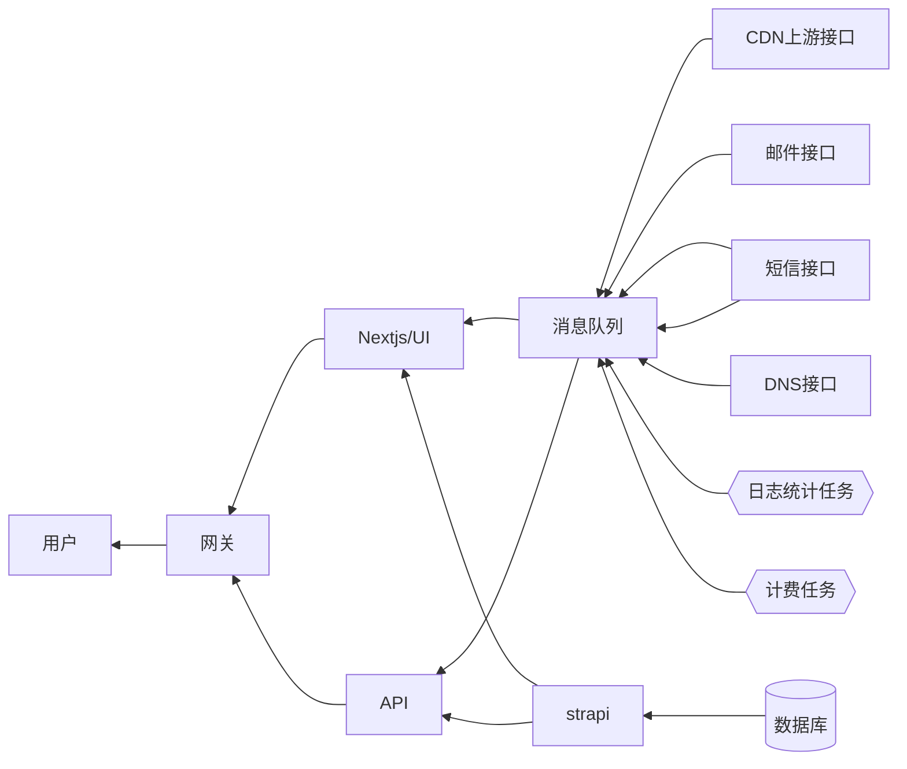

```mermaid
flowchart RL;
    数据库[(数据库)]
    日志统计任务{{日志统计任务}}
    计费任务{{计费任务}}
    CDN上游接口-->消息队列;
    短信接口-->消息队列;
    邮件接口-->消息队列;
    DNS接口-->消息队列;
    短信接口-->消息队列;
    日志统计任务-->消息队列;
    计费任务-->消息队列;
    数据库-->strapi;
    消息队列-->Nextjs/UI;
    strapi-->Nextjs/UI;
    strapi-->API;
    消息队列-->API;
    Nextjs/UI-->网关;
    API-->网关;
    网关-->用户;
```
