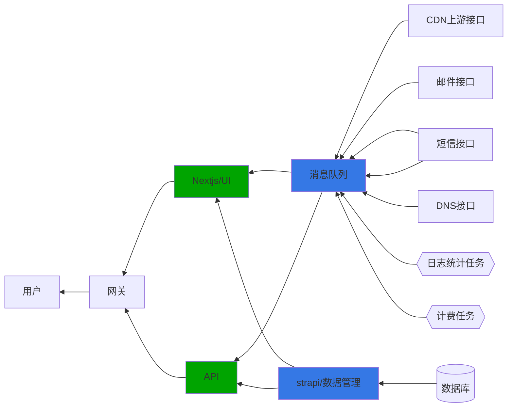

:::tip
所有功能模块分为三类：
- 前台（绿色部分）：包括 Nextjs/UI、API
- 中台（蓝色部分）：消息队列、strapi/数据管理
- 后台：各个上游接口、定期执行的任务、数据库
:::

:::info
API 的目的是用于代理系统，等未来规划、实现！
:::

```mermaid
flowchart RL;
    数据库[(数据库)]
    日志统计任务{{日志统计任务}}
    计费任务{{计费任务}}
    style Nextjs/UI fill:#00a400
    style API fill:#00a400
    style strapi/数据管理 fill:#3578e5
    style 消息队列 fill:#3578e5
    CDN上游接口-->消息队列;
    短信接口-->消息队列;
    邮件接口-->消息队列;
    DNS接口-->消息队列;
    短信接口-->消息队列;
    日志统计任务-->消息队列;
    计费任务-->消息队列;
    数据库-->strapi/数据管理;
    消息队列 & strapi/数据管理-->Nextjs/UI & API;
    Nextjs/UI & API-->网关;
    网关-->用户;
```

