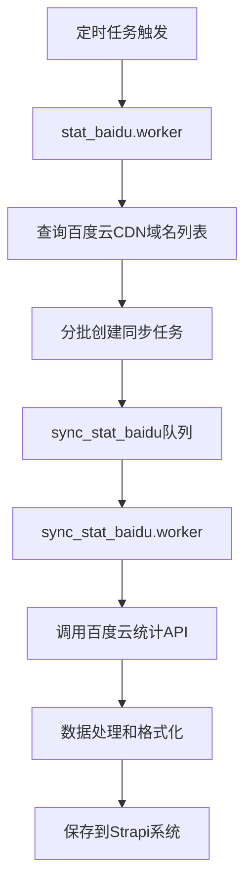

# 统计流程

## 概述

统计流程负责收集和同步百度云CDN的流量统计数据，由两个核心Worker组成：
- `stat_baidu.worker.js`: 统计任务分发器，负责分批获取域名并创建同步任务
- `sync_stat_baidu.worker.js`: 统计数据同步器，负责从百度云API获取流量数据并存储到系统中

## 工作流程

### 1. 统计任务分发 (stat_baidu.worker)

**文件位置**: `src/worker/stat_baidu.worker.js`

**主要功能**:
- 从Strapi CMS中分页获取所有百度云CDN域名
- 为每批域名创建同步任务并添加到队列中
- 控制并发数为1，确保任务按序执行

**执行流程**:
1. 获取当前UTC时间作为统计周期基准
2. 分页查询Strapi中`upstream='baidu'`的CDN域名（每页10个）
3. 为每批域名创建同步任务：
   ```javascript
   {
     period: data.period,      // 统计周期（300s/3600s/86400s）
     startTime: utc.begin,     // 开始时间
     endTime: utc.next,        // 结束时间
     keys: domainGroup        // 域名列表
   }
   ```
4. 将任务添加到`sync_stat_baidu`队列
5. 重复直到所有域名处理完成

### 2. 统计数据同步 (sync_stat_baidu.worker)

**文件位置**: `src/worker/sync_stat_baidu.worker.js`

**主要功能**:
- 调用百度云统计API获取域名流量数据
- 按不同时间维度整理数据（5分钟/1小时/1天）
- 将处理后的数据同步到Strapi系统

**执行流程**:
1. 接收分发任务中的参数（时间周期、域名列表等）
2. 调用百度云统计API查询流量数据：
   ```javascript
   await client.queryFlow({
     startTime: startTime,
     endTime: endTime,
     period: period,        // 300(5分钟)/3600(1小时)/86400(1天)
     key: keys,            // 域名列表
     groupBy: 'key'        // 按域名分组
   })
   ```
3. 数据处理和转换：
   - 转换时间格式为UTC+8
   - 按域名和日期创建唯一标识 `${domain}#${date}`
   - 根据统计周期整理数据结构：
     - `period=300`: 保存到`fiveMinutes`字段
     - `period=3600`: 保存到`hour`字段  
     - `period=86400`: 保存到`day`字段

4. 数据存储：
   ```javascript
   {
     domain: "example.com",    // 域名
     date: "2025-07-26",      // 日期
     day: 123456,             // 日流量（仅当period=86400时）
     hour: {                  // 小时流量数据（仅当period=3600时）
       "2025-07-26 10:00:00": 1234,
       "2025-07-26 11:00:00": 2345
     },
     fiveMinutes: {          // 五分钟流量数据（仅当period=300时）
       "2025-07-26 10:00:00": 123,
       "2025-07-26 10:05:00": 234
     }
   }
   ```

5. 通过Strapi API `/sync/stat` 接口批量保存数据

## 配置参数

### stat_baidu.worker 配置
- **并发数**: 1（确保任务按序执行）
- **分页大小**: 10个域名/批次

### sync_stat_baidu.worker 配置  
- **并发数**: 5（支持多任务并行处理）
- **支持的统计周期**:
  - `300`: 5分钟粒度统计
  - `3600`: 1小时粒度统计  
  - `86400`: 1天粒度统计

## 数据流向



## 错误处理

- **stat_baidu.worker**: 当无法找到更多域名时自然结束
- **sync_stat_baidu.worker**: 
  - 使用try-catch捕获API调用异常
  - 记录错误日志但不中断流程
  - 当域名列表为空时直接返回成功状态

## 监控和日志

- 任务开始时记录启动日志和任务数据
- 分页查询时输出当前处理进度
- API调用和数据同步结果都有详细日志记录
- 支持通过Strapi任务状态插件跟踪任务执行状态
